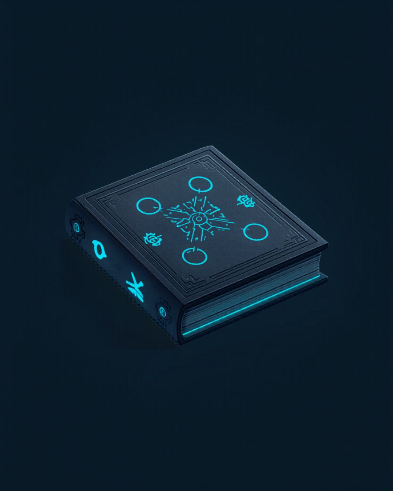

<p align="center">
  
</p>

<h1 align="center">TGV-Grimoire</h1>

<p align="center">
  <strong>A bilingual cybersecurity prompt library for practitioners.</strong><br>
  <em>Una biblioteca bilingüe de prompts de ciberseguridad para profesionales.</em>
</p>

<p align="center">
  <a href="#"></a>
  <a href="#"></a>
  <a href="#"></a>
  <a href="LICENSE"></a>
  <a href="https://buymeacoffee.com/thegr8val"></a>
</p>

```
  ___________    __   __  ___  ____  ____  __  ____  ____
  |__    __|  / _\ \/ / / __||  _ \|_ _||  \/  |/ _\ |  _ \
     |  |  | |  |\ / /| |  _|| |_) || | | |\/| |  | || |_) |
     |  |  | |__/ | | | |__| |  _ < | | | |  | |__| ||  _ <
     |__|   \____/|_|  \____||_| \_\___||_|  |_|\____/|_| \_\

  Cybersecurity prompt library — battle-tested  |  thegr8val
```

---

## 📖 About

**TGV-Grimoire** is a curated collection of LLM prompts engineered for cybersecurity practitioners — analysts, threat hunters, detection engineers, and red teamers who leverage AI in their daily workflows.

Every prompt is:

| Property | Detail |
|---|---|
| 🧪 **Battle-tested** | Used in real or lab environments |
| 🗂️ **Documented** | Author · use case · model tested · language · tags |
| 🔁 **Ready to use** | Fill `[PLACEHOLDERS]` and send |
| 🌐 **Bilingual** | English primary, `[ES]` sections throughout |

---

## 🗂️ Modules

```
  TGV-Grimoire/
  │
  ├── 🎯 hunting/           ── 11 prompts
  │   ├── llm-analysis/     ── Chat-mode: IOC triage, actor profiling, log analysis
  │   └── automation-api/   ── API-mode: KQL/Sigma/YARA/SPL generation
  │
  ├── 🦠 malware-analysis/  ──  3 prompts
  │   ├── llm-analysis/     ── String deobfuscation, C2 fingerprinting
  │   └── automation-api/   ── Packer identification, YARA rule gen
  │
  ├── 🗡️  red-team/          ──  3 prompts
  │   ├── llm-analysis/     ── Tabletop exercise builder
  │   └── automation-api/   ── Detection gap analysis
  │
  ├── 🔍 osint/             ──  3 prompts
  │   ├── llm-analysis/     ── Passive recon, persona analysis
  │   └── automation-api/   ── Lookalike domain generation
  │
  ├── 📋 reporting/         ──  3 prompts
  │   ├── llm-analysis/     ── Executive summaries, postmortems
  │   └── automation-api/   ── Findings → remediation tickets
  │
  └── 🛡️  blue-team/         ──  3 prompts
      ├── llm-analysis/     ── Detection rule review, response playbooks
      └── automation-api/   ── Crown jewels mapping
```

| Module | Prompts | Best For |
|--------|:-------:|----------|
| 🎯 [`/hunting`](./hunting/) | **11** | IOC triage · Sigma/YARA/KQL/SPL generation · actor profiling |
| 🦠 [`/malware-analysis`](./malware-analysis/) | **3** | String deobfuscation · C2 fingerprinting · packer ID |
| 🗡️ [`/red-team`](./red-team/) | **3** | Tabletop exercises · detection gap analysis |
| 🔍 [`/osint`](./osint/) | **3** | Passive recon · persona analysis · lookalike domains |
| 📋 [`/reporting`](./reporting/) | **3** | Executive summaries · postmortems · remediation tickets |
| 🛡️ [`/blue-team`](./blue-team/) | **3** | Detection review · response playbooks · crown jewels |

---

## ⚙️ Two Prompt Types Per Module

```
  ┌──────────────────────────────────┬──────────────────────────────────┐
  │  💬 llm-analysis/                │  ⚙️  automation-api/              │
  │                                  │                                  │
  │  For direct LLM chat             │  For programmatic API use        │
  │  Feed data → structured analysis │  Output is JSON/YAML/KQL/Sigma   │
  │  Narrative, actionable           │  No prose — machine-parseable    │
  └──────────────────────────────────┴──────────────────────────────────┘
```

---

## 🚀 Usage

```bash
git clone https://github.com/TheGr8Val/TGV-Grimoire.git
cd TGV-Grimoire/hunting/llm-analysis
```

Open any `.md` file, substitute `[PLACEHOLDER]` values, and send to your model of choice (Claude, GPT-4o, Gemini, etc.).

---

## 🧬 Prompt Metadata Format

Every prompt starts with:

```yaml
---
title: "Prompt title"
author: thegr8val
use_case: "Short description of the use case"
model_tested:
  - claude-sonnet-4-6
  - gpt-4o
language: EN/ES
tags:
  - hunting
  - ioc
  - automation
---
```

### Tag Taxonomy

```
  hunting      ioc          threat-actor   malware      log-analysis
  sigma        yara         splunk         kql          automation
  api          enrichment   triage         reporting    red-team
  blue-team    osint
```

---

## 🌐 [ES] Descripción

**TGV-Grimoire** es una colección bilingüe de prompts de ciberseguridad para analistas, hunters e ingenieros que aprovechan modelos de IA en sus flujos de trabajo. Cada prompt incluye metadatos completos y está listo para usarse en entornos reales. Los placeholders se indican con `[MAYUSCULAS_EN_CORCHETES]`.

---

## 🤝 Contributing

See [CONTRIBUTING.md](./CONTRIBUTING.md) for guidelines, metadata format, and the tag taxonomy.

## 🔒 Security

Found a sensitive file accidentally committed? See [SECURITY.md](./SECURITY.md) — report privately, not via public issues.

---

## 📄 License

[MIT](./LICENSE) — thegr8val

---

<p align="center">
  <strong>TGV Toolkit</strong><br><br>
  <a href="https://github.com/TheGr8Val/TGV-ReportForge">
    
  </a>
  <a href="https://github.com/TheGr8Val/TGV-VulnSpotter">
    
  </a>
  <a href="https://github.com/TheGr8Val/TGV-KQLDojo">
    
  </a>
  <a href="https://github.com/TheGr8Val/TGV-CareerCompass">
    
  </a>
  <br><br>
  <a href="https://buymeacoffee.com/thegr8val">
    
  </a>
  <br><br>
  <em>Made with 🔮 by <strong>thegr8val</strong></em>
</p>
